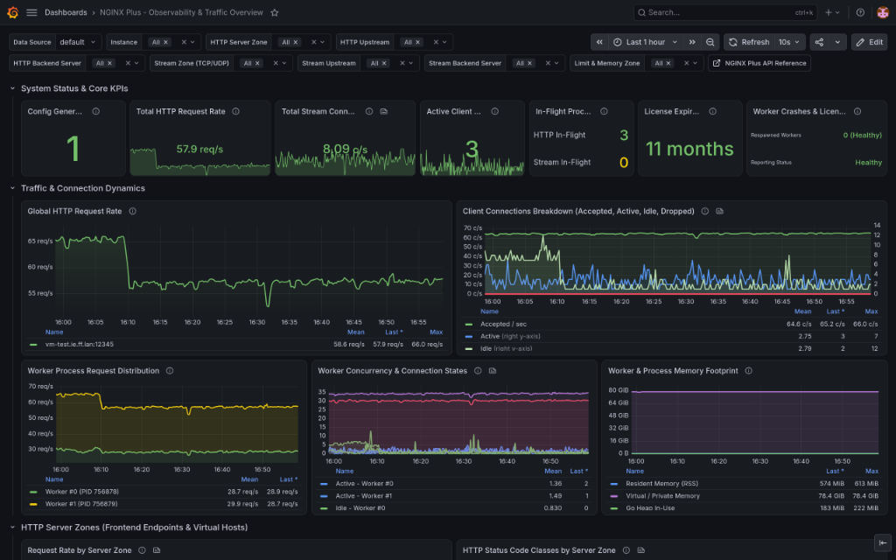
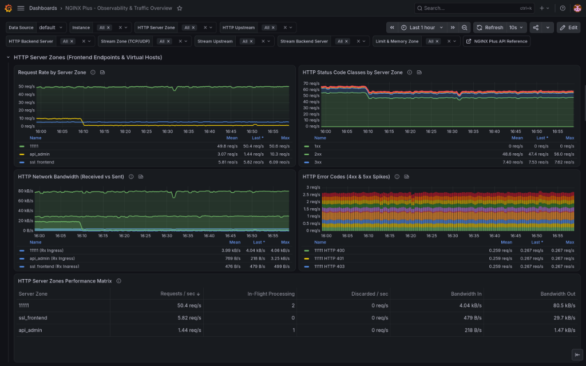
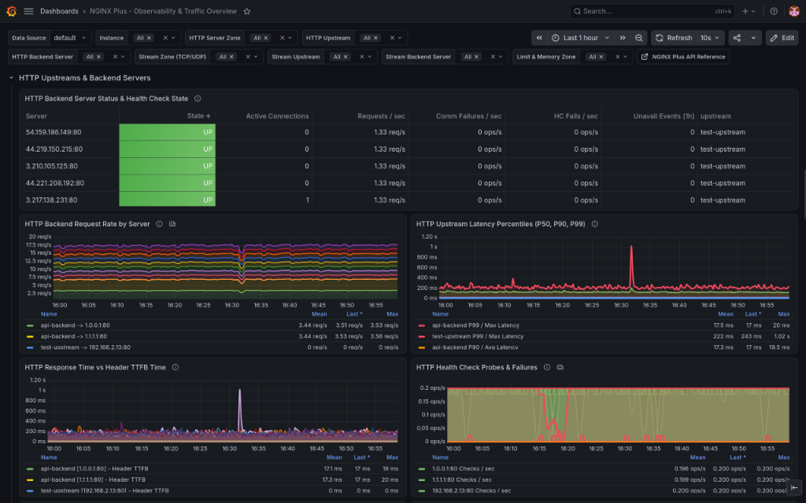
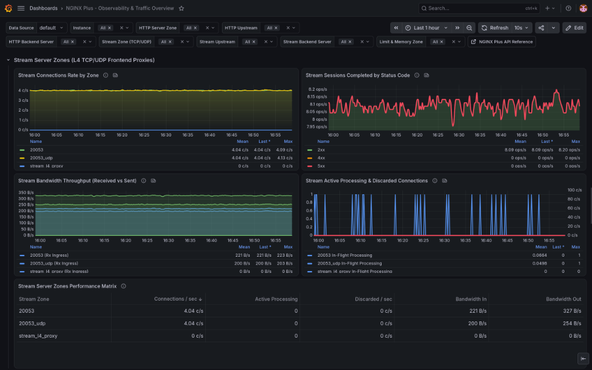
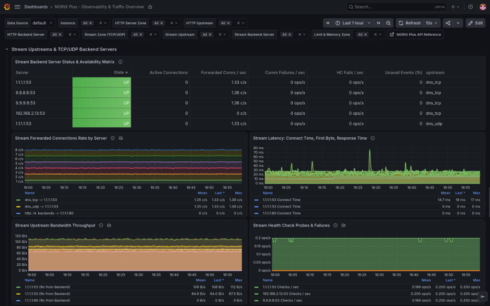
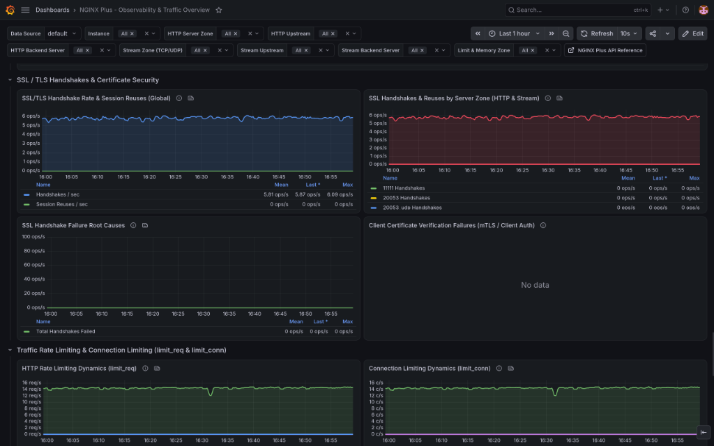
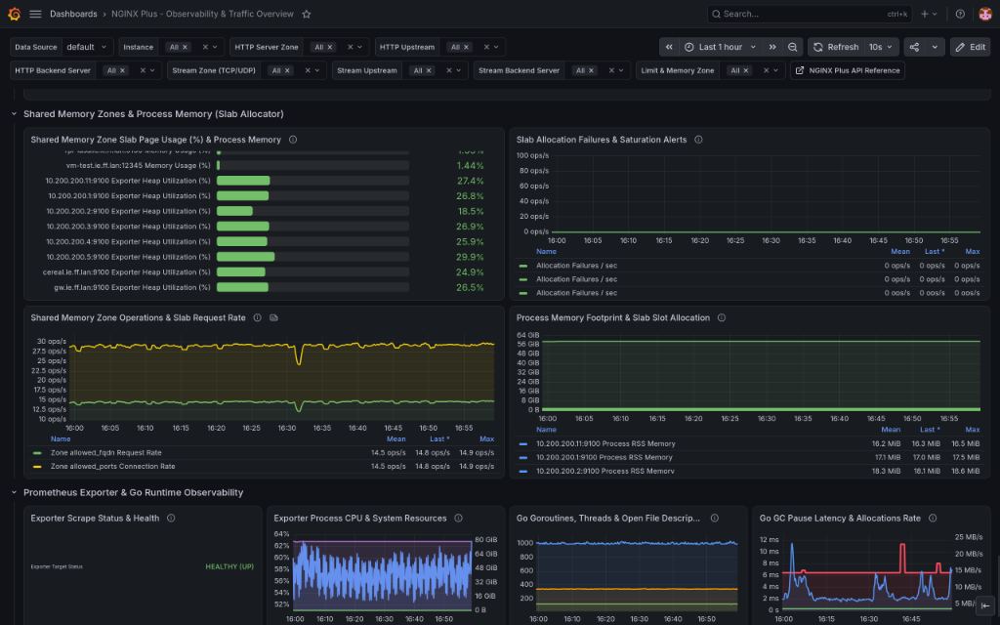

# NGINX Plus Observability Suite for Grafana & Prometheus

[](https://grafana.com/)
[](https://prometheus.io/)
[](https://www.nginx.com/products/nginx/)
[](https://github.com/nginx/nginx-prometheus-exporter)

An enterprise-grade, production-tested Grafana dashboard designed specifically for **NGINX Plus** monitoring. It delivers full-stack observability across **Layer 7 HTTP/HTTPS** virtual server zones, **Layer 4 TCP/UDP Stream** reverse proxies, **HTTP Upstream Backends**, **Stream Upstreams**, **Rate Limiting (`limit_req`)**, **Connection Limiting (`limit_conn`)**, **SSL/TLS Security**, **Shared Memory & Process Memory**, and **Prometheus Exporter Go Runtime Health**.

---

## 🧪 Validated Environment & Architecture

> [!IMPORTANT]
> This dashboard has been thoroughly tested on **Grafana** using **Prometheus** as its datasource, scraping live NGINX Plus metrics exposed through the official **[`nginx/nginx-prometheus-exporter`](https://github.com/nginx/nginx-prometheus-exporter)** (`-nginx.plus` collector).

```
   ┌────────────────────────────────────────────────────────┐
   │                       NGINX Plus                       │
   │      HTTP Virtual Hosts & TCP/UDP Stream Proxies       │
   │           Live Status API enabled at /api              │
   └───────────────────────────┬────────────────────────────┘
                               │ JSON API Telemetry
                               ▼
   ┌────────────────────────────────────────────────────────┐
   │            nginx-prometheus-exporter                   │
   │    https://github.com/nginx/nginx-prometheus-exporter  │
   │       Scrapes /api, converts to Prometheus metrics     │
   └───────────────────────────┬────────────────────────────┘
                               │ Pull Scrape (:9113/metrics)
                               ▼
   ┌────────────────────────────────────────────────────────┐
   │                   Prometheus TSDB                      │
   │            Time-series storage & PromQL                │
   └───────────────────────────┬────────────────────────────┘
                               │ ${DS_PROMETHEUS}
                               ▼
   ┌────────────────────────────────────────────────────────┐
   │                   Grafana Dashboard                    │
   │               nginx-plus-overview.json                 │
   │     61 Panels · 10 Functional Rows · Multi-Cluster     │
   └────────────────────────────────────────────────────────┘
```

---

## 📸 Screenshots

### 1. System Status, Core KPIs & Connection Dynamics (Rows 1 & 2)
High-level operational executive KPIs (Config reload generation, HTTP req/s & Stream conn/s throughput, active connections, in-flight processing, license expiration countdown, respawned worker crashes, and reporting health state), coupled with real-time connection dynamics (accepted/active/idle/dropped), worker process request distribution, worker concurrency, and memory footprint.

<p align="center">
  
</p>

---

### 2. HTTP Server Zones & Virtual Hosts (Row 3)
Layer 7 HTTP frontend observability tracking client request rates by virtual host / server zone, 1xx–5xx HTTP status code distributions, ingress/egress network bandwidth (Rx/Tx), 4xx & 5xx error code spike diagnostics, and complete server zones operational performance matrix.

<p align="center">
  
</p>

---

### 3. HTTP Upstreams, Latency Percentiles (P50, P90, P99) & Backend Health (Row 4)
Detailed HTTP upstream performance featuring real-time backend availability matrix with health check states (`UP` in green), backend request rates, multi-tier latency curves (P50, P90, P99 with Header TTFB vs response time), and active health check probes vs failures.

<p align="center">
  
</p>

---

### 4. Stream Server Zones — L4 TCP/UDP Frontend Proxies (Row 5)
Layer 4 proxy telemetry across TCP and UDP endpoints, tracking connection throughput per zone, completed session response codes (2xx/4xx/5xx), bandwidth Rx/Tx, concurrent in-flight sessions, and server zone operational matrix.

<p align="center">
  
</p>

---

### 5. Stream Upstreams & TCP/UDP Backend Clusters (Row 6)
Layer 4 backend server health matrix (`UP` / `DOWN`), forwarded connection rates per backend (e.g. DNS TCP/UDP resolvers), connection latency breakdown (connect time, time to first byte, session duration), bandwidth throughput, and active health checks.

<p align="center">
  
</p>

---

### 6. SSL/TLS Security & Traffic Rate Limiting (Rows 7 & 8)
Cryptographic and traffic shaping observability tracking global SSL/TLS handshakes and session reuses, handshake failure root causes, client certificate verification failures (mTLS), and real-time evaluation of `limit_req` and `limit_conn` zones (passed, delayed, and rejected requests).

<p align="center">
  
</p>

---

### 7. Shared Memory Slab Allocator & Prometheus Exporter Runtime (Rows 9 & 10)
Zone slab page utilization (%) and saturation alerts, shared memory access rates, process RSS and virtual memory footprint, alongside exporter health (`nginxplus_up`), CPU/system resources, Go goroutines, threads, file descriptors, and GC pause durations.

<p align="center">
  
</p>

---

## 📁 Repository Structure

- **[`nginx-plus-overview.json`](file:///C:/Users/fiorucci/.gemini/antigravity/scratch/nginx-grafana-dashboard/nginx-plus-overview.json)**: Ready-to-import Grafana dashboard JSON definition (**61 panels across 10 functional rows**).
- **[`nginx.conf`](file:///C:/Users/fiorucci/.gemini/antigravity/scratch/nginx-grafana-dashboard/nginx.conf)**: Complete NGINX Plus production reference configuration with HTTP server zones, upstreams, stream TCP/UDP zones, rate & connection limit zones, active health checks, and the `/api` endpoint.
- **[`generate_traffic.sh`](file:///C:/Users/fiorucci/.gemini/antigravity/scratch/nginx-grafana-dashboard/generate_traffic.sh)**: High-concurrency bash traffic simulator generating realistic 2xx/3xx/4xx/5xx responses, latency variations, rate limit bursts, SSL handshakes, and UDP DNS requests.
- **[`generate_dashboard.py`](file:///C:/Users/fiorucci/.gemini/antigravity/scratch/nginx-grafana-dashboard/generate_dashboard.py)**: Python generator script used to compile and maintain the Grafana dashboard JSON model.
- **[`docker-compose.yml`](file:///C:/Users/fiorucci/.gemini/antigravity/scratch/nginx-grafana-dashboard/docker-compose.yml)**: Multi-container stack spinning up NGINX Plus, `nginx-prometheus-exporter`, Prometheus, and Grafana.
- **[`prometheus.yml`](file:///C:/Users/fiorucci/.gemini/antigravity/scratch/nginx-grafana-dashboard/prometheus.yml)**: Prometheus scrape configuration targeting the exporter.
- **[`screenshots/`](file:///C:/Users/fiorucci/.gemini/antigravity/scratch/nginx-grafana-dashboard/screenshots/)**: Dashboard screenshots and visual previews.

---

## ⚡ Key Architectural Highlights & Zero-Empty-Data Design

### 1. Robust Upstream Latency Percentiles (P50, P90, P99)
- Standard histogram buckets (`_hist_bucket`) are not exposed by the default Go exporter.
- The dashboard employs **adaptive PromQL fallback expressions**:
  - **P99 / Max Latency**: `(histogram_quantile(0.99, ...) * 1000) or max by (upstream) (nginxplus_upstream_server_response_time{...})`
  - **P90 / Avg Latency**: `(histogram_quantile(0.90, ...) * 1000) or avg by (upstream) (nginxplus_upstream_server_response_time{...})`
  - **P50 / Header TTFB**: `(histogram_quantile(0.50, ...) * 1000) or avg by (upstream) (nginxplus_upstream_server_header_time{...})`
  - **Min Latency**: `min by (upstream) (nginxplus_upstream_server_response_time{...})`
- Result: Instant, accurate millisecond latency curves whether using histogram collectors or `nginx-prometheus-exporter`.

### 2. Dual-Engine Shared Memory & Process Memory Monitoring
- NGINX Plus exposes slab memory (`/api/slabs`) via the NJS module (`prometheus.js`), whereas `nginx-prometheus-exporter` exposes Go runtime and process memory (`process_resident_memory_bytes`, `process_virtual_memory_bytes`, `go_memstats_*`).
- The dashboard automatically adapts:
  - **Memory Usage (%)**: Calculates Slab page usage when available, seamlessly falling back to NGINX Process RSS vs Virtual memory utilization.
  - **Saturation & Failures**: Evaluates slab allocation failures with a zero-safe fallback so the panel displays a clean, healthy `0 ops/s` baseline instead of "No data".
  - **Zone Operations**: Plots shared memory rate and connection limit zone throughput (`limit_req_passed`, `limit_conn_passed`).
  - **Footprint**: Displays real physical memory (RSS) and virtual memory in bytes.

### 3. Fallback-Safe Matrix Tables
- All operational matrix tables (HTTP Server Zones, HTTP Upstream Servers, Stream Zones, Stream Upstream Servers, Rate/Conn Limit Zones) use `format: "table"`, `instant: true`, explicit column transformations, and PromQL fallback joins (`or (0 * primary_metric)`).
- Table rows are never dropped if an optional counter (such as health check probes or 4xx errors) has not yet incremented.

### 4. Upstream Server Health Enum Mapping
- Full mapping for NGINX Plus backend server operational states (States 0 through 6) with colored badges:
  - `1`: **UP** (Green `#73BF69`)
  - `2`: **DRAINING** (Amber `#E5A00D`)
  - `3`: **DOWN** (Red `#F2495C`)
  - `4`: **UNAVAIL** (Red `#F2495C`)
  - `5`: **CHECKING** (Blue `#5794F2`)
  - `6`: **UNHEALTHY** (Crimson `#E02F44`)
  - `0`: **DOWN** (Red `#F2495C`)

---

## 📊 Dashboard Functional Rows (10 Sections)

1. **System Status & Core KPIs**: Configuration reload generations, active client connections, global HTTP request rate, stream connection rate, in-flight processing, license expiration, worker process crashes, and reporting health.
2. **Traffic & Connection Dynamics**: Accepted, active, idle, and dropped client connections, worker process load distribution, worker concurrency, and memory footprint.
3. **HTTP Server Zones (Frontend Endpoints & Virtual Hosts)**: Request rate by virtual host, status code distributions (1xx-5xx), bandwidth throughput (Rx/Tx), 4xx/5xx error tracking, and complete operational performance matrix.
4. **HTTP Upstreams & Backend Servers**: Upstream backend availability matrix with health checks, request rates, latency distribution (P50/P90/P99), TTFB vs response time, keepalive pool utilization, and zombie backends.
5. **Stream Server Zones (L4 TCP/UDP Frontend Proxies)**: Stream connections rate, completed sessions by status code class, bandwidth throughput (Rx/Tx), in-flight processing, and stream performance matrix.
6. **Stream Upstreams & TCP/UDP Backend Servers**: L4 backend availability table, connection rates, latency breakdown (connect time, first byte, response time), bandwidth, and active TCP/UDP health checks.
7. **SSL / TLS Handshakes & Certificate Security**: Global and per-zone SSL handshakes and session reuses, handshake failures by root cause (handshake timeout, peer reject, unsupported cipher/protocol), and client certificate verification errors (mTLS).
8. **Traffic Rate Limiting & Connection Limiting (`limit_req` & `limit_conn`)**: Real-time evaluation of passed, delayed, and rejected requests, dry-run tracking, and operational matrix table.
9. **Shared Memory Zones & Process Memory (Slab Allocator)**: Zone slab page usage, allocation failure alerts, zone access rates, and process RSS/virtual memory footprint.
10. **Prometheus Exporter & Go Runtime Observability**: Exporter scrape target status (`nginxplus_up`), CPU usage, RSS memory, Go goroutines, threads, file descriptors, and GC pause durations.

---

## 🎯 Dashboard Variables & Dynamic Filtering

| Variable | Query Definition | Purpose |
| :--- | :--- | :--- |
| **Data Source (`$DS_PROMETHEUS`)** | Datasource: `prometheus` | Switch between Prometheus environments. |
| **Instance (`$instance`)** | `label_values({__name__=~"nginxplus_.*|nginx_.*"}, instance)` | Multi-select NGINX Plus clusters or standalone nodes. |
| **HTTP Server Zone (`$server_zone`)** | `label_values({__name__=~"nginxplus_server_zone_.*", instance=~"$instance"}, server_zone)` | Filter by HTTP/HTTPS virtual host or frontend zone. |
| **HTTP Upstream (`$upstream`)** | `label_values({__name__=~"nginxplus_upstream_server_.*", instance=~"$instance"}, upstream)` | Filter by backend upstream cluster name. |
| **HTTP Backend Server (`$server`)** | `label_values({__name__=~"nginxplus_upstream_server_.*", instance=~"$instance", upstream=~"$upstream"}, server)` | Filter specific backend IP and port targets. |
| **Stream Zone (`$stream_server_zone`)** | `label_values({__name__=~"nginxplus_stream_server_zone_.*", instance=~"$instance"}, server_zone)` | Filter TCP/UDP reverse proxy endpoints. |
| **Stream Upstream (`$stream_upstream`)** | `label_values({__name__=~"nginxplus_stream_upstream_server_.*", instance=~"$instance"}, upstream)` | Filter Layer 4 backend upstream groups. |
| **Stream Backend Server (`$stream_server`)** | `label_values({__name__=~"nginxplus_stream_upstream_server_.*", instance=~"$instance", upstream=~"$stream_upstream"}, server)` | Filter specific TCP/UDP backend targets. |
| **Limit & Memory Zone (`$zone`)** | `label_values({__name__=~"nginxplus_limit_.*|nginxplus_slab_.*", instance=~"$instance"}, zone)` | Filter rate limiting, connection limiting, and slab zones. |

---

## 🚀 Quick Start Guide

### 1. Enable the NGINX Plus API
Add the `/api` endpoint to an internal management block in your `nginx.conf`:

```nginx
http {
    server {
        listen 127.0.0.1:8080;
        server_name localhost;

        location /api {
            api write=off;
            allow 127.0.0.1;
            deny all;
        }
    }
}
```

### 2. Run the NGINX Prometheus Exporter
Run the official exporter pointing to the NGINX Plus API:

```bash
# Using Docker
docker run -p 9113:9113 \
  nginx/nginx-prometheus-exporter:latest \
  -nginx.plus \
  -nginx.scrape-uri=http://127.0.0.1:8080/api

# Or binary execution
./nginx-prometheus-exporter -nginx.plus -nginx.scrape-uri=http://127.0.0.1:8080/api
```

### 3. Configure Prometheus Scrape Target
Add the scrape job to your `prometheus.yml`:

```yaml
scrape_configs:
  - job_name: 'nginx-plus'
    scrape_interval: 5s
    static_configs:
      - targets: ['localhost:9113']
```

### 4. Import the Dashboard into Grafana
1. In Grafana, navigate to **Dashboards** > **New** > **Import**.
2. Upload [`nginx-plus-overview.json`](file:///C:/Users/fiorucci/.gemini/antigravity/scratch/nginx-grafana-dashboard/nginx-plus-overview.json) or paste its contents.
3. Select your Prometheus datasource in the **Prometheus** dropdown.
4. Click **Import**.

---

## 🔔 Recommended Alertmanager Rules

```yaml
groups:
  - name: nginx_plus_alerts
    rules:
      # Exporter Target Unreachable
      - alert: NginxPlusExporterDown
        expr: nginxplus_up == 0
        for: 1m
        labels:
          severity: critical
        annotations:
          summary: "NGINX Plus Prometheus exporter target {{ $labels.instance }} is unreachable"

      # HTTP Backend Unhealthy or Down
      - alert: NginxPlusHttpBackendUnhealthy
        expr: nginxplus_upstream_server_state{upstream=~".+"} != 1 and nginxplus_upstream_server_state{upstream=~".+"} != 2
        for: 1m
        labels:
          severity: critical
        annotations:
          summary: "HTTP backend {{ $labels.server }} in upstream {{ $labels.upstream }} is unhealthy (state: {{ $value }})"

      # Stream Backend Unhealthy or Down (TCP/UDP)
      - alert: NginxPlusStreamBackendUnhealthy
        expr: nginxplus_stream_upstream_server_state{upstream=~".+"} != 1 and nginxplus_stream_upstream_server_state{upstream=~".+"} != 2
        for: 1m
        labels:
          severity: critical
        annotations:
          summary: "Stream backend {{ $labels.server }} in upstream {{ $labels.upstream }} is unhealthy (state: {{ $value }})"

      # High Rate Limiting Rejection Spikes
      - alert: NginxPlusRateLimitRejections
        expr: sum by (instance, zone) (rate(nginxplus_limit_request_rejected[2m])) > 10
        for: 1m
        labels:
          severity: warning
        annotations:
          summary: "Zone {{ $labels.zone }} on {{ $labels.instance }} is rejecting >10 req/s due to rate limiting"

      # Slab Memory Allocation Failure (Out of Memory in Zone)
      - alert: NginxPlusSlabAllocationFailed
        expr: sum by (instance, zone) (rate(nginxplus_slab_fails[2m])) > 0
        for: 1m
        labels:
          severity: critical
        annotations:
          summary: "Shared memory zone {{ $labels.zone }} on {{ $labels.instance }} failed to allocate memory slots"

      # License Expiration Warning (< 14 days)
      - alert: NginxPlusLicenseExpiringSoon
        expr: (nginxplus_license_expiration_timestamp_seconds - time()) < (14 * 86400)
        for: 1h
        labels:
          severity: warning
        annotations:
          summary: "NGINX Plus subscription license on {{ $labels.instance }} expires in less than 14 days"
```

## ⚖ License

This repository is licensed under the Apache License, Version 2.0. You are free to use, modify, and distribute this codebase within the terms and conditions outlined in the license. For more details, please refer to the [LICENSE](/LICENSE.md) file.
